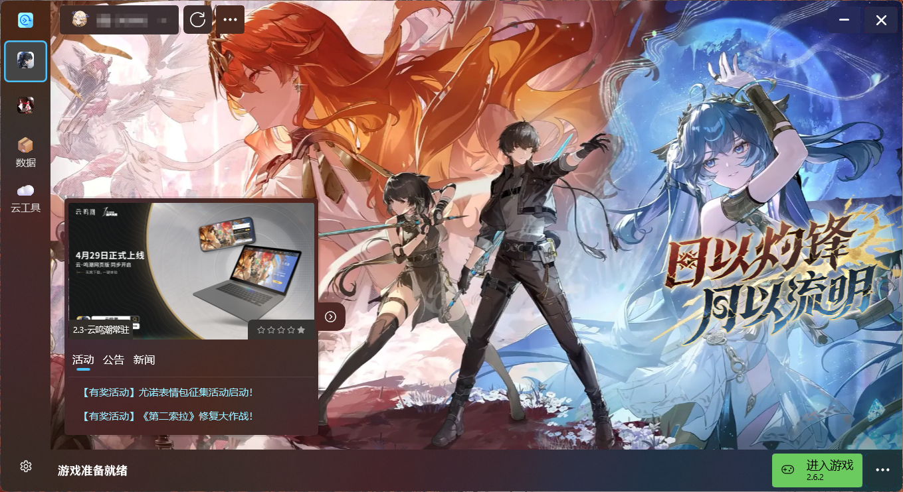

   <h1>鸣潮增强型启动器</h1>
   
    
    

   
   
   
   

<h4> 此程序编写目的是为了增强鸣潮游戏体验而编写 </h4>

##### 公告

1.2.7 Official Version 已更新

##### 下载

进入到<a href="https://github.com/BlameTwo/WutheringWavesTool/releases">Release</a>页面下载最新版本进行安装。

##### 其他引用

[WindowsAppSdk](https://github.com/microsoft/WindowsAppSDK)
[DevWinUI](https://github.com/ghost1372/DevWinUI)
[CommunityToolkit](https://github.com/CommunityToolkit)
[WinUIEx](https://github.com/dotMorten/WinUIEx)
[H.NotifyIcon.WinUI](https://github.com/HavenDV/H.NotifyIcon)
[Win2D](https://github.com/microsoft/Win2D)

鸣谢
[扑克](https://github.com/Poker-sang)
[ghost1372](https://github.com/ghost1372)
